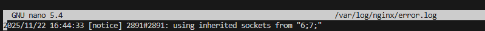
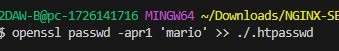

# Installation and Configuration of Nginx Web Server with VM

**Author:** Alejandra Fernández López & Mario Acosta Vargas

**Date:** November 2025  

**Technology Stack:** Debian Bullseye · Nginx · Git  

This project provides the installation and configuration of an **Nginx web server** on Debian, including creating a sample website, setting the correct permissions, and configuring server blocks.

The environment can be reproduced on any Debian machine by following the steps in this README.

---

# 1. Requirements

Install the following components on the host machine or directly on Debian:

- **Debian 11 Bullseye**  
- **Nginx**  
- **Git** 
---

# 2. Project Structure

```bash
vagrant-server/
│
├── Vagrantfile
└── config/
    ├── bootstrap.sh           
    ├── nginx.conf.template     
    └── vsftpd.conf.template    
```
---

# 3. Server Configuration Summary
| Setting          | Value                          | Description                           |
|-----------------|--------------------------------|---------------------------------------|
| **VM Box**        | `debian/bullseye64`           | Operating system                      |
| **Hostname**      | `ns.ieszaidinvergeles.org`    | DNS server hostname                    |
| **Web Hostname**  | `nginx.ieszaidinvergeles.org` | The public hostname for the Nginx Web Server |
| **Domain Name**   | `ieszaidinvergeles.org`       | Authoritative DNS zone                 |
| **FTP Cname**     | `ftp.ieszaidinvergeles.org`   | CNAME record                           |
| **IP Address**    | `192.168.56.101`              | Static private IP                      |
| **Reverse Zone**  | `56.168.192.in-addr.arpa`     | PTR lookup zone                        |
| **SSL Certificate** | Generated automatically      | Required by FTPS                        |


This configuration is fully automated through the `bootstrap.sh` script.

---


# 4. Deploy the Server

This section details the configuration of the Nginx Virtual Host after the base services (BIND9, VSFTPD, and Nginx) have been installed by the bootstrap.sh script.


## 4.1. Configure the Server Block (Virtual Host)

Nginx uses two key directories: sites-available for defined server blocks, and sites-enabled for active configurations. 

### 4.1.1. Create the Configuration File
Create the configuration file for your website in sites-available.

Note: The document root path is defined in your script as /var/www/nginx.ieszaidinvergeles.org/html.

``` Bash
sudo nano /etc/nginx/sites-available/nginx.ieszaidinvergeles.org
```
``` bash
server {
    listen 80;
    listen [::]:80;

    root /var/www/nginx.ieszaidinvergeles.org/html; 

    index index.html index.htm index.nginx-debian.html;

    server_name nginx.ieszaidinvergeles.org;

    location / {
        try_files $uri $uri/ =404;
    }
}
``` 

### 4.1.2. Enable Site and Restart Service
Create a symbolic link (symlink) to enable the site and restart the Nginx service.


#### 1. Create symbolic link to enable the site
```bash
sudo ln -s /etc/nginx/sites-available/nginx.ieszaidinvergeles.org /etc/nginx/sites-enabled/
```

#### 2. Restart the server to apply the configuration
```bash
sudo systemctl restart nginx
```

# 5. Server Verifications

We will verify proper functioning.

## 5.1 — Access the Website

If you do not have a dedicated DNS server configured to translate hostnames to IP addresses, you must perform this resolution manually.
There are two ways to do it:

Option A: Edit the Hosts File
You will edit the `/etc/hosts` file on your host machine to associate the Virtual Machine's IP address with your server_name.

Linux/macOS Location: `/etc/hosts`

Windows Location: `C:\Windows\System32\drivers\etc\hosts`

You must add the following line, substituting 192.168.56.101 with your Virtual Machine's actual IP address:

```bash
192.168.56.101 nginx.ieszaidinvergeles.org
```


Option B: Use the nip.io Service
Modify the server_name directive in your Nginx configuration file (/etc/nginx/sites-available/nginx.ieszaidinvergeles.org) to look like this:

```bash
server_name 192-168-56-101.nginx.ieszaidinvergeles.org.nip.io;
```

---

# 6. Access Verification

We will check for correct operation of the logs. Once you have tried to access http://nginx.ieszaidinvergeles.org, verify that requests are being correctly registered in the log files, including both successful and failed ones.


## Request Log (access.log)
This file records every request sent to your web server, unless Nginx is configured to do otherwise. Here you will see successful responses.

```bash
sudo nano /var/log/nginx/access.log
```


## Error Log (error.log)
Any Nginx errors (configuration, permissions, or internal 403/500 errors) will be settled in this log.

```Bash
sudo nano /var/log/nginx/error.log
```


-------

# 7. Implementing Security (Auth & SSL)

## 7.1 Necessary Packages

For this practice, we can use the OpenSSL tool to create the passwords. 
First, we need to check if the package is installed:

```Bash
dpkg -l | grep openssl
```

## 7.2 Creating Users and Passwords for Web Access

We will create a file named `.htpasswd` on your host machine within your website's configuration structure.

### 7.2.1 Add the first user

Create the file and add the username

```Bash
mario:
```

Generate the encrypted password using the Docker container and append it to the file:



The file should look similar to this (each user on a separate line):

```Bash
Mario:$apr1$p8GCWcjP$C2bCXndx2BDzW/cK4nxxO.
```

This process can be repeated for as many users as needed.

---

# 8. Configure the Nginx container to use basic authentication

We will edit the Nginx configuration file. If we didn't have one created yet, we could extract the default configuration file from the image to edit it using the following command:

```Bash
docker run --rm --entrypoint=cat nginx /etc/nginx/conf.d/default.conf > ./config/conf/nginx.conf
```

We will edit the file `./config/conf/nginx.conf`:

```Bash
nano ./config/conf/nginx.conf
```

We must decide which resources will be protected. Nginx allows adding restrictions at the server level or in a specific location (directory or file).

We will use the `auth_basic` directive inside the `location` block and assign it the name of our domain, which will be shown to the user when requesting credentials. Finally, we configure Nginx to use the file we previously created using the `auth_basic_user_file directive`.

```bash
server {
    listen 80;
    listen [::]:80;
    
    root /var/www/%%WEB_HOSTNAME%%/html;
    
    index index.html index.htm index.nginx-debian.html;
    
    server_name %%WEB_HOSTNAME%%;
    
    location / {
        try_files $uri $uri/ =404;
    }
}
```
Once the configuration is finished, we restart the service so that our access policy is applied.

```Bash
sudo systemctl restart nginx
```
---

# 9. Combination of basic authentication with IP access restriction

HTTP Basic Authentication can be effectively combined with IP address restrictions. In our configuration, we have implemented the most secure scenario where a user must satisfy both conditions simultaneously: they must connect from a valid IP AND be authenticated with a username and password.

We applied this to the root location (`/`), meaning the entire website is protected.

```Bash
location / {
        satisfy all;

        allow 192.168.56.1;     
        allow 127.0.0.1;        
        deny all;               

        auth_basic "Restricted Area SSL";
        auth_basic_user_file /etc/nginx/.htpasswd;

        try_files \$uri \$uri/ =404;
    }
```

Explanation of Directives:

1.`satisfy all;`

· This directive tells Nginx that the client must satisfy all access phases.

· Condition 1: The client's IP must be allowed by the access rules.

· Condition 2: The client must successfully log in with a valid user/password.

· If the directive were set to `any`, satisfying just one condition (e.g., having a valid IP) would bypass the password prompt, but we enforce all for maximum security.

2.IP Access Control Rules: Nginx applies these rules in the order they appear in the file.

· `deny 192.168.1.2;`: Explicitly blocks this specific IP address first. If a request comes from here, it is rejected immediately.

· `allow 172.16.0.0/12;`: Allows traffic from the Docker internal network range.

· `allow 127.0.0.1;`: Allows traffic from Localhost (the container itself or local checks).

· `allow 192.168.56.1;`: Allows traffic from the Host machine (typically the VirtualBox/Vagrant adapter IP).

3.Authentication:

· `auth_basic ...`: Defines the realm name displayed to the user ("Restricted Secure Area").

· `auth_basic_user_file ...`: Points to the .htpasswd file containing the valid encrypted credentials.

---

# 10. Firewall Configuration

If we don’t have a firewall installed, we will use ufw

```bash
$ sudo apt install ufw
```

We will check if the firewall is active and which profiles are enabled.

```bash
$ sudo ufw status
```

We will activate the profile to allow HTTPS traffic

```bash
$ sudo ufw allow ssh 
$ sudo ufw allow Nginx Full
$ sudo ufw delete allow Nginx HTTP
```

---

 # 11. SSL certificate configuration

 The certificate will store basic information about the website, and it will be accompanied by a private key file that allows the server to handle encrypted data sent to it.

We will create the SSL key and the certificate using the OpenSSL command.

```bash
sudo openssl req -x509 -nodes -days 365 \ 
  -newkey rsa:2048 -keyout ./config/certs/server.key \ 
  -out ./config/certs/server.crt \
  -subj "/CN=nginx.ieszaidinvergeles"
```

We will add the use of an SSL certificate to the configuration of our site:

```bash
server {
    listen 80;
    listen 443 ssl;

    root $WEB_ROOT;
    index index.html index.htm index.nginx-debian.html;
    server_name $WEB_HOSTNAME;

    ssl_certificate /etc/ssl/certs/$WEB_HOSTNAME.crt;
    ssl_certificate_key /etc/ssl/private/$WEB_HOSTNAME.key;
    ssl_protocols TLSv1.2 TLSv1.3;
    ssl_ciphers HIGH:!aNULL:!MD5;

    location / {
        satisfy all;

        allow 192.168.56.1;     
        allow 127.0.0.1;        
        deny all;               

        auth_basic "Restricted Area SSL";
        auth_basic_user_file /etc/nginx/.htpasswd;

        try_files \$uri \$uri/ =404;
    }
}
```
---

# Installation and Configuration of Nginx Web Server with Docker

Author: Alejandra Fernández López & Mario Acosta Vargas

Date: November 2025

Technology Stack: Docker · Nginx · Git

This project details the installation and configuration of an Nginx web server using Docker containers, leveraging volume mounting and a custom configuration file for portability and isolation.

The environment uses `nginx.ieszaidinvergeles` as the domain for demonstration purposes.

---

# 1. Requirements 

Install the following components on your host machine:

- **Docker**  
- **Git**  

---

# 2. Project Structure

```bash
docker-server/
│
├── config/
|   └──conf/
|      └──nginx.conf
└── html/
|   ├── assets/ 
|   |   └── css/
|   |   ├── fonts/
|   |   ├── js/
|   |   └── sass
|   |
|   ├── error/    
|   |   └── index.html
|   └── images/ 
|       └── index.html
|
├── Dockerfile
├── docker-compose.yml
└── docker-comand.sh

```

Inside the html folder, we clone the following repository:

```bash
cd ~/nginx/docker-server/config/html
git clone https://github.com/cloudacademy/static-website-example .
```
---

# 3. Server Configuration Summary

| Setting          | Value                          | Description                           |
|-----------------|--------------------------------|---------------------------------------|
| **Domain Name**        | `nginx.ieszaidinvergeles`           | Hostname configured in the Nginx `server_name` directive.system                      |
| **Access IP**      | `localhost:8080`    | IP and port the host machine will use to access the service                    |
| **Port Mapping**  | `8080:80` | 	Maps host port 8080 to container port 80 |
| **Container Name**   | `nginx-docker-commands`       | Name assigned to the running container instance                 |
| **Container Image**     | `nginx:latest`   | Base Docker image used                            |
| **Internal Root Path**    | `/usr/share/nginx/html`              | Directory inside the container where files are served from (root)                |
| **Nginx Config Path**  | `/etc/nginx/conf.d/default.conf`     | Location of the custom configuration file inside the container                        |

---

# 4. Deploy the Server


## 4.1. Create Nginx Configuration File (Host)

Create the Nginx configuration file on your host machine in the project's configuration directory.

```bash
nano ./config/conf/nginx.conf
```
Use the following content for the server block. Note that the root path is the location inside the container, and the server_name is your designated domain.

```bash
server {
  listen 80;
  listen [::]:80;
  root /usr/share/nginx/html; ①
  index index.html index.htm index.nginx-debian.html;
  server_name nginx.ieszaidinvergeles;
  location / {
  try_files $uri $uri/ =404;
  }
}
```

## 4.2 Create and Run the Docker Container (Host)

Now, we will create a Docker container that executes Nginx. This container will mount your website files and the custom configuration file from your host machine. We will use port `8080` on the host.

Use the following command from your project's root directory `docker-server/`:

```bash
docker run -d \
  --name $CONTAINER_NAME \
  -p $HOST_PORT:80 \
  -v "$(pwd)/html":/usr/share/nginx/html \
  -v "$(pwd)/conf/nginx.conf":/etc/nginx/conf.d/default.conf \
  nginx:latest
  ```

## 4.3 Verification Commands

To check that the container is running:

```bash
docker ps
```


To view the container logs:

```bash
docker logs nginx-docker-commands
```
---

# 5. Server Verifications

We will verify proper functioning.

You can access the web server from your client using the following methods:

## 5.1 From the Same Host Machine (where Docker is running):

```bash
http://localhost
```
## 5.2 From Another Machine on the Network:

```bash
http://192.168.56.101:8080
```


---

## 5.3 Edit the Hosts File

You will edit the hosts file on your host machine to associate the loopback IP (127.0.0.1) with your specific domain name, allowing you to test the server_name directive in Nginx.

Linux/macOS Location: `/etc/hosts`

Windows Location: `C:\Windows\System32\drivers\etc\hosts`

You must add the following line, pointing to the local IP address:

```bash
127.0.0.1 nginx.ieszaidinvergeles
```


# 6. Access Verification

We will check for correct operation of the logs. Once you have tried to access http://nginx.ieszaidinvergeles.org, verify that requests are being correctly registered in the log files, including both successful and failed ones.

## Request Log (access.log)
This file records every request sent to your web server, unless Nginx is configured to do otherwise. Here you will see successful responses.

```bash
sudo nano /var/log/nginx/access.log
```


## Error Log (error.log)
Any Nginx errors (configuration, permissions, or internal 403/500 errors) will be settled in this log.

```Bash
sudo nano /var/log/nginx/error.log
```
---

# 7. Container Management

This section details the commands for managing the lifecycle of your Nginx container once it has been created.

## 7.1 Stop the Container
To gracefully stop the running container:

```bash
docker stop nginx-docker-commands
```

## 7.2 Restart the Container
To restart a stopped container or reload a running one:

```bash
docker restart nginx-docker-commands
```

## 7.3 Modify the Configuration
If you need to change the Nginx configuration, edit the configuration file on your host machine and then restart the container to apply the changes.

Edit the file on your host machine: `./config/conf/nginx.conf`

Restart the container to reload the mounted configuration:

```bash
docker restart nginx-docker-commands
```

## 7.4 Delete the Container
To completely remove the container from your system when you no longer need it, you must first stop it and then remove it.

Stop the container:

```bash
docker stop nginx-docker-commands
```

Remove the container:

```bash
docker rm nginx-docker-commands
```

---

8. Alternative: Using Docker Compose

If you prefer a more robust and reproducible configuration, you can use Docker Compose. It allows you to define all services, ports, and volumes in a single YAML file, simplifying the deployment process.

## 8.1 Create the Docker Compose File (Host)

Create the configuration file in the root of your project:

```bash
nano ./docker-compose.yml
```

Use the following content, ensuring the volumes paths match your project structure:

Content of `docker-compose.yml`

```bash
version: '3.8'

services:
  nginx-custom:
    build: .
    image: my-custom-nginx-image
    container_name: nginx-compose-version
    ports:
      - "8080:80"
    restart: unless-stopped
```

## 8.2 Execute the Container with Docker Compose
Navigate to your project root directory (docker-server/) and execute the following command to build, create, and start the service in detached mode.

```bash
docker-compose up -d
```

## 8.3 Management Commands

Docker Compose simplifies the management of the service:

View Logs (Real-time): `docker-compose logs -f`

Stop Containers: `docker-compose down`

---

# 9. Implementing Security (Auth & SSL)

We have implemented a dual-layer security system involving Basic Authentication and SSL encryption.

## 9.1 Necessary Packages

For this practice, we will use OpenSSL utilities to generate encrypted passwords. These utilities are readily available in the `stakater/ssl-certs-generator` Docker container, so we don't need to install anything on the host machine.

Download the image on your host machine:

```Bash
docker pull stakater/ssl-certs-generator
```

## 9.2 Creating Users and Passwords for Web Access

We will create a file named `.htpasswd` on your host machine within your website's configuration structure.

### 9.2.1 Add the first user

Create the file and add the username

```Bash
mario:
```

Generate the encrypted password using the Docker container and append it to the file:


The file should look similar to this (each user on a separate line):

```Bash
Mario:$apr1$p8GCWcjP$C2bCXndx2BDzW/cK4nxxO.
```

This process can be repeated for as many users as needed.

---

# 10. Configure the Nginx container to use basic authentication

We will edit the Nginx configuration file. If we didn't have one created yet, we could extract the default configuration file from the image to edit it using the following command:

```Bash
docker run --rm --entrypoint=cat nginx /etc/nginx/conf.d/default.conf > ./config/conf/nginx.conf
```

We will edit the file `./config/conf/nginx.conf`:

```Bash
nano ./config/conf/nginx.conf
```

We must decide which resources will be protected. Nginx allows adding restrictions at the server level or in a specific location (directory or file).

We will use the `auth_basic` directive inside the `location` block and assign it the name of our domain, which will be shown to the user when requesting credentials. Finally, we configure Nginx to use the file we previously created using the `auth_basic_user_file directive`.

```bash
server {
  listen 80;
  listen [::]:80;
  listen 443 ssl;
  root /usr/share/nginx/html; 
  index index.html index.htm index.nginx-debian.html;
  server_name nginx.ieszaidinvergeles;
    
    location / {
        satisfy all;

        deny 192.168.1.2;     
        allow 172.16.0.0/12;   
        allow 127.0.0.1;       
        allow 192.168.56.1;   
                
        auth_basic "Restricted Secure Area";
        auth_basic_user_file /etc/nginx/.htpasswd;
        try_files $uri $uri/ =404;
    }
}
```

Now, we run the container with the updated volume mappings to include the password file:

```Bash
docker run -d \
  --name $CONTAINER_NAME \
  -p $HOST_PORT:80 \
  -p $HTTPS_PORT:443 \
  -v "$(pwd)/config/html":/usr/share/nginx/html \
  -v "$(pwd)/config/conf/nginx.conf":/etc/nginx/conf.d/default.conf \
  -v "$(pwd)/config/conf/.htpasswd":/etc/nginx/.htpasswd \
  nginx:latest
```
---

# 11. Combination of basic authentication with IP access restriction

HTTP Basic Authentication can be effectively combined with IP address restrictions. In our configuration, we have implemented the most secure scenario where a user must satisfy both conditions simultaneously: they must connect from a valid IP AND be authenticated with a username and password.

We applied this to the root location (`/`), meaning the entire website is protected.

```Bash
location / {
        satisfy all;

        deny 192.168.1.2;     
        allow 172.16.0.0/12;   
        allow 127.0.0.1;       
        allow 192.168.56.1;   
                
        auth_basic "Restricted Secure Area";
        auth_basic_user_file /etc/nginx/.htpasswd;
        try_files $uri $uri/ =404;
    }
```

Explanation of Directives:

1.`satisfy all;`

· This directive tells Nginx that the client must satisfy all access phases.

· Condition 1: The client's IP must be allowed by the access rules.

· Condition 2: The client must successfully log in with a valid user/password.

· If the directive were set to `any`, satisfying just one condition (e.g., having a valid IP) would bypass the password prompt, but we enforce all for maximum security.

2.IP Access Control Rules: Nginx applies these rules in the order they appear in the file.

· `deny 192.168.1.2;`: Explicitly blocks this specific IP address first. If a request comes from here, it is rejected immediately.

· `allow 172.16.0.0/12;`: Allows traffic from the Docker internal network range.

· `allow 127.0.0.1;`: Allows traffic from Localhost (the container itself or local checks).

· `allow 192.168.56.1;`: Allows traffic from the Host machine (typically the VirtualBox/Vagrant adapter IP).

3.Authentication:

· `auth_basic ...`: Defines the realm name displayed to the user ("Restricted Secure Area").

· `auth_basic_user_file ...`: Points to the .htpasswd file containing the valid encrypted credentials.

---

# 12. SSL certificate configuration

We will add the use of an SSL certificate to our site’s configuration.

```bash
server {
  listen 80;
  listen [::]:80;
  listen 443 ssl;
  root /usr/share/nginx/html; 
  index index.html index.htm index.nginx-debian.html;
  server_name nginx.ieszaidinvergeles;

    ssl_certificate /etc/ssl/certs/server.crt;
    ssl_certificate_key /etc/ssl/certs/server.key;
    ssl_protocols TLSv1 TLSv1.1 TLSv1.2 TLSv1.3;
    ssl_ciphers HIGH:!aNULL:!MD5;
    
    location / {
        satisfy all;

        deny 192.168.1.2;     
        allow 172.16.0.0/12;   
        allow 127.0.0.1;       
        allow 192.168.56.1;   
                
        auth_basic "Restricted Secure Area";
        auth_basic_user_file /etc/nginx/.htpasswd;
        try_files $uri $uri/ =404;
    }
}
```
---

# 13. Port mapping and volume mounting with certificates

· We will map ports 80 and 443 to access the web service.

· We will mount the certificates via a bind mount at the path specified in the configuration.

```bash
version: '3.8'

services:
  nginx-custom:
    build: .
    image: my-custom-nginx-image
    container_name: nginx-compose-version
    ports:
      - "8080:80"
      - "8443:443"
    volumes:
      - ./config/html:/usr/share/nginx/html
      - ./config/conf/nginx.conf:/etc/nginx/conf.d/default.conf
      - ./config/conf/.htpasswd:/etc/nginx/.htpasswd
      - ./config/certs:/etc/ssl/certs
    restart: unless-stopped
```


